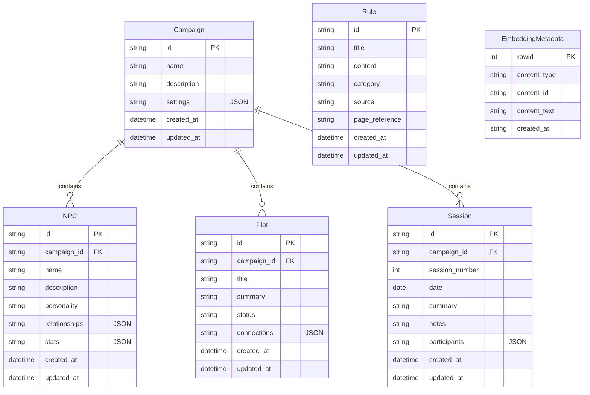

# Data Models Reference

This section documents the Diesel ORM models used in the Mimir database layer. These models provide type-safe database operations and automatic serialization/deserialization.

## Entity Relationships



## Model Structure

Each entity has three model variants:
- **Base model**: For querying existing records
- **New model**: For inserting new records (excludes auto-generated fields)
- **Update model**: For modifying existing records (all fields optional)

## Campaign Models

### Campaign
Primary model for D&D campaigns:

```rust
#[derive(Debug, Clone, PartialEq, Eq, Queryable, Selectable, Serialize, Deserialize)]
#[diesel(table_name = campaigns)]
pub struct Campaign {
    pub id: String,
    pub name: String,
    pub description: Option<String>,
    pub settings: Option<String>, // JSON serialized CampaignSettings
    pub created_at: NaiveDateTime,
    pub updated_at: NaiveDateTime,
}
```

### NewCampaign
For creating new campaigns:

```rust
#[derive(Debug, Clone, PartialEq, Eq, Insertable, Serialize, Deserialize)]
#[diesel(table_name = campaigns)]
pub struct NewCampaign {
    pub id: String,
    pub name: String,
    pub description: Option<String>,
    pub settings: Option<String>,
}
```

### UpdateCampaign
For modifying existing campaigns:

```rust
#[derive(Debug, Clone, PartialEq, Eq, AsChangeset, Serialize, Deserialize)]
#[diesel(table_name = campaigns)]
pub struct UpdateCampaign {
    pub name: Option<String>,
    pub description: Option<String>,
    pub settings: Option<String>,
    pub updated_at: NaiveDateTime,
}
```

## NPC Models

### Npc
Model for non-player characters:

```rust
#[derive(Debug, Clone, PartialEq, Eq, Queryable, Selectable, Serialize, Deserialize)]
#[diesel(table_name = npcs)]
pub struct Npc {
    pub id: String,
    pub campaign_id: String,
    pub name: String,
    pub description: Option<String>,
    pub personality: Option<String>,
    pub relationships: Option<String>, // JSON serialized
    pub stats: Option<String>, // JSON serialized
    pub created_at: NaiveDateTime,
    pub updated_at: NaiveDateTime,
}
```

### NewNpc
For creating new NPCs:

```rust
#[derive(Debug, Clone, PartialEq, Eq, Insertable, Serialize, Deserialize)]
#[diesel(table_name = npcs)]
pub struct NewNpc {
    pub id: String,
    pub campaign_id: String,
    pub name: String,
    pub description: Option<String>,
    pub personality: Option<String>,
    pub relationships: Option<String>,
    pub stats: Option<String>,
}
```

### UpdateNpc
For modifying existing NPCs:

```rust
#[derive(Debug, Clone, PartialEq, Eq, AsChangeset, Serialize, Deserialize)]
#[diesel(table_name = npcs)]
pub struct UpdateNpc {
    pub name: Option<String>,
    pub description: Option<String>,
    pub personality: Option<String>,
    pub relationships: Option<String>,
    pub stats: Option<String>,
    pub updated_at: NaiveDateTime,
}
```

## Plot Models

### Plot
Model for story arcs and plot threads:

```rust
#[derive(Debug, Clone, PartialEq, Eq, Queryable, Selectable, Serialize, Deserialize)]
#[diesel(table_name = plots)]
pub struct Plot {
    pub id: String,
    pub campaign_id: String,
    pub title: String,
    pub summary: Option<String>,
    pub status: String, // "active", "paused", "completed"
    pub connections: Option<String>, // JSON serialized
    pub created_at: NaiveDateTime,
    pub updated_at: NaiveDateTime,
}
```

### NewPlot
For creating new plots:

```rust
#[derive(Debug, Clone, PartialEq, Eq, Insertable, Serialize, Deserialize)]
#[diesel(table_name = plots)]
pub struct NewPlot {
    pub id: String,
    pub campaign_id: String,
    pub title: String,
    pub summary: Option<String>,
    pub status: String,
    pub connections: Option<String>,
}
```

### UpdatePlot
For modifying existing plots:

```rust
#[derive(Debug, Clone, PartialEq, Eq, AsChangeset, Serialize, Deserialize)]
#[diesel(table_name = plots)]
pub struct UpdatePlot {
    pub title: Option<String>,
    pub summary: Option<String>,
    pub status: Option<String>,
    pub connections: Option<String>,
    pub updated_at: NaiveDateTime,
}
```

## Session Models

### Session
Model for game sessions:

```rust
#[derive(Debug, Clone, PartialEq, Eq, Queryable, Selectable, Serialize, Deserialize)]
#[diesel(table_name = sessions)]
pub struct Session {
    pub id: String,
    pub campaign_id: String,
    pub session_number: i32,
    pub date: chrono::NaiveDate,
    pub summary: Option<String>,
    pub notes: Option<String>,
    pub participants: Option<String>, // JSON serialized
    pub created_at: NaiveDateTime,
    pub updated_at: NaiveDateTime,
}
```

### NewSession
For creating new sessions:

```rust
#[derive(Debug, Clone, PartialEq, Eq, Insertable, Serialize, Deserialize)]
#[diesel(table_name = sessions)]
pub struct NewSession {
    pub id: String,
    pub campaign_id: String,
    pub session_number: i32,
    pub date: chrono::NaiveDate,
    pub summary: Option<String>,
    pub notes: Option<String>,
    pub participants: Option<String>,
}
```

### UpdateSession
For modifying existing sessions:

```rust
#[derive(Debug, Clone, PartialEq, Eq, AsChangeset, Serialize, Deserialize)]
#[diesel(table_name = sessions)]
pub struct UpdateSession {
    pub date: Option<chrono::NaiveDate>,
    pub summary: Option<String>,
    pub notes: Option<String>,
    pub participants: Option<String>,
    pub updated_at: NaiveDateTime,
}
```

## Rule Models

### Rule
Model for D&D rules and references:

```rust
#[derive(Debug, Clone, PartialEq, Eq, Queryable, Selectable, Serialize, Deserialize)]
#[diesel(table_name = rules)]
pub struct Rule {
    pub id: String,
    pub title: String,
    pub content: String,
    pub category: String, // "spell", "class", "race", "item", etc.
    pub source: Option<String>, // "PHB", "DMG", etc.
    pub page_reference: Option<String>,
    pub created_at: NaiveDateTime,
    pub updated_at: NaiveDateTime,
}
```

### NewRule
For creating new rules:

```rust
#[derive(Debug, Clone, PartialEq, Eq, Insertable, Serialize, Deserialize)]
#[diesel(table_name = rules)]
pub struct NewRule {
    pub id: String,
    pub title: String,
    pub content: String,
    pub category: String,
    pub source: Option<String>,
    pub page_reference: Option<String>,
}
```

### UpdateRule
For modifying existing rules:

```rust
#[derive(Debug, Clone, PartialEq, Eq, AsChangeset, Serialize, Deserialize)]
#[diesel(table_name = rules)]
pub struct UpdateRule {
    pub title: Option<String>,
    pub content: Option<String>,
    pub category: Option<String>,
    pub source: Option<String>,
    pub page_reference: Option<String>,
    pub updated_at: NaiveDateTime,
}
```

## Embedding Models

### EmbeddingMetadata
Model for vector embedding metadata:

```rust
#[derive(Debug, Clone, PartialEq, Eq, Queryable, Selectable, Serialize, Deserialize)]
#[diesel(table_name = embedding_metadata)]
pub struct EmbeddingMetadata {
    pub rowid: i64,
    pub content_type: String, // "npc", "plot", "rule", etc.
    pub content_id: String,
    pub content_text: String,
    pub created_at: String,
}
```

### NewEmbeddingMetadata
For creating new embedding records:

```rust
#[derive(Debug, Clone, PartialEq, Eq, Insertable, Serialize, Deserialize)]
#[diesel(table_name = embedding_metadata)]
pub struct NewEmbeddingMetadata {
    pub content_type: String,
    pub content_id: String,
    pub content_text: String,
}
```

## Common Patterns

### JSON Serialization
Several fields store JSON-serialized data:
- `Campaign.settings`: Campaign configuration
- `Npc.relationships`: NPC relationship mappings  
- `Npc.stats`: Character statistics
- `Plot.connections`: Plot interconnections
- `Session.participants`: Player/character data

### Timestamps
All models include automatic timestamp fields:
- `created_at`: Set on record creation
- `updated_at`: Updated on record modification

### Foreign Keys
Models maintain referential integrity:
- `Npc.campaign_id` → `Campaign.id`
- `Plot.campaign_id` → `Campaign.id`
- `Session.campaign_id` → `Campaign.id`
- `EmbeddingMetadata.content_id` → Various entity IDs

### Diesel Traits
All models implement standard Diesel traits:
- `Queryable`: For SELECT operations
- `Selectable`: For type-safe column selection
- `Insertable`: For INSERT operations
- `AsChangeset`: For UPDATE operations
- `Serialize`/`Deserialize`: For JSON conversion