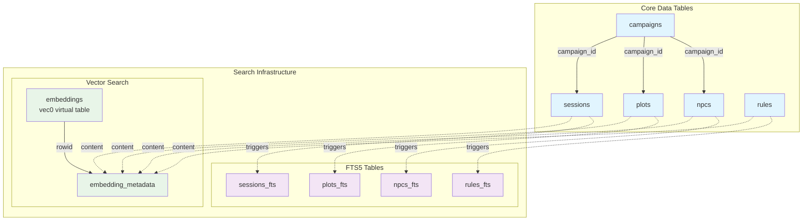

# Database Schema Reference

This section documents the complete database schema for Mimir, including table structures, relationships, and indexing strategies.

## Database Architecture



## Core Tables

### Campaigns
Primary entity representing D&D campaigns:

```sql
CREATE TABLE campaigns (
    id TEXT PRIMARY KEY NOT NULL,
    name TEXT NOT NULL,
    description TEXT,
    settings TEXT, -- JSON serialized settings
    created_at TIMESTAMP NOT NULL DEFAULT CURRENT_TIMESTAMP,
    updated_at TIMESTAMP NOT NULL DEFAULT CURRENT_TIMESTAMP
);
```

- **id**: UUID primary key
- **name**: Human-readable campaign name
- **description**: Optional campaign overview
- **settings**: JSON-serialized campaign configuration
- **created_at/updated_at**: Audit timestamps

### NPCs
Non-player character definitions linked to campaigns:

```sql
CREATE TABLE npcs (
    id TEXT PRIMARY KEY NOT NULL,
    campaign_id TEXT NOT NULL,
    name TEXT NOT NULL,
    description TEXT,
    personality TEXT,
    relationships TEXT, -- JSON serialized relationships
    stats TEXT, -- JSON serialized stats
    created_at TIMESTAMP NOT NULL DEFAULT CURRENT_TIMESTAMP,
    updated_at TIMESTAMP NOT NULL DEFAULT CURRENT_TIMESTAMP,
    FOREIGN KEY (campaign_id) REFERENCES campaigns (id) ON DELETE CASCADE
);
```

- **campaign_id**: Links to parent campaign
- **name**: NPC name
- **description**: Physical description and background
- **personality**: Character traits and motivations
- **relationships**: JSON-encoded relationships to other NPCs/PCs
- **stats**: JSON-encoded mechanical statistics

### Plots
Story arc and plot thread tracking:

```sql
CREATE TABLE plots (
    id TEXT PRIMARY KEY NOT NULL,
    campaign_id TEXT NOT NULL,
    title TEXT NOT NULL,
    summary TEXT,
    status TEXT NOT NULL DEFAULT 'active', -- active, paused, completed
    connections TEXT, -- JSON serialized connections to NPCs/other plots
    created_at TIMESTAMP NOT NULL DEFAULT CURRENT_TIMESTAMP,
    updated_at TIMESTAMP NOT NULL DEFAULT CURRENT_TIMESTAMP,
    FOREIGN KEY (campaign_id) REFERENCES campaigns (id) ON DELETE CASCADE
);
```

- **status**: Plot lifecycle state (active, paused, completed)
- **connections**: JSON-encoded links to NPCs and other plots
- **summary**: Plot description and current state

### Sessions
Individual game session records:

```sql
CREATE TABLE sessions (
    id TEXT PRIMARY KEY NOT NULL,
    campaign_id TEXT NOT NULL,
    session_number INTEGER NOT NULL,
    date DATE NOT NULL,
    summary TEXT,
    notes TEXT,
    participants TEXT, -- JSON serialized list of participants
    created_at TIMESTAMP NOT NULL DEFAULT CURRENT_TIMESTAMP,
    updated_at TIMESTAMP NOT NULL DEFAULT CURRENT_TIMESTAMP,
    FOREIGN KEY (campaign_id) REFERENCES campaigns (id) ON DELETE CASCADE,
    UNIQUE(campaign_id, session_number)
);
```

- **session_number**: Sequential session numbering within campaign
- **participants**: JSON-encoded player/character information
- **summary**: Session recap
- **notes**: DM notes and observations

### Rules
D&D rule references and custom house rules:

```sql
CREATE TABLE rules (
    id TEXT PRIMARY KEY NOT NULL,
    title TEXT NOT NULL,
    content TEXT NOT NULL,
    category TEXT NOT NULL, -- spell, class, race, item, etc.
    source TEXT, -- PHB, DMG, etc.
    page_reference TEXT,
    created_at TIMESTAMP NOT NULL DEFAULT CURRENT_TIMESTAMP,
    updated_at TIMESTAMP NOT NULL DEFAULT CURRENT_TIMESTAMP
);
```

- **category**: Rule classification (spell, class, race, item, etc.)
- **source**: Book reference (PHB, DMG, XGE, etc.)
- **page_reference**: Specific page citation

## Search Infrastructure

### Full-Text Search (FTS5)
Optimized search across all content types using SQLite's FTS5:

```sql
-- Example: Rules FTS table
CREATE VIRTUAL TABLE rules_fts USING fts5(
    rule_id UNINDEXED,
    title,
    content,
    category,
    tokenize='porter unicode61 remove_diacritics 2'
);
```

Features:
- **Porter stemming**: Matches related word forms
- **Unicode support**: Handles special characters
- **Diacritic removal**: Ignores accents
- **Automatic triggers**: Keep FTS tables synchronized

### Vector Search (sqlite-vec)
Semantic similarity search using embeddings:

```sql
-- Vector storage for 384-dimensional embeddings
CREATE VIRTUAL TABLE embeddings USING vec0(
    embedding float[384] -- nomic-embed-text produces 384-dimensional vectors
);

-- Metadata table for vector context
CREATE TABLE embedding_metadata (
    rowid INTEGER PRIMARY KEY,
    content_type TEXT NOT NULL,
    content_id TEXT NOT NULL,
    content_text TEXT NOT NULL,
    created_at TEXT NOT NULL DEFAULT CURRENT_TIMESTAMP
);
```

- **384 dimensions**: Compatible with nomic-embed-text model
- **Content linking**: Maps vectors to source content
- **Semantic search**: Find conceptually similar content

## Performance Optimization

### Indexes
Strategic indexing for common query patterns:

```sql
-- Campaign-based queries
CREATE INDEX idx_npcs_campaign_id ON npcs(campaign_id);
CREATE INDEX idx_plots_campaign_id ON plots(campaign_id);
CREATE INDEX idx_sessions_campaign_id ON sessions(campaign_id);

-- Search and filtering
CREATE INDEX idx_plots_status ON plots(status);
CREATE INDEX idx_rules_category ON rules(category);
CREATE INDEX idx_sessions_date ON sessions(date);
```

### Query Patterns
- **Campaign isolation**: All queries scope to specific campaigns
- **Hybrid search**: Combine FTS5 and vector search results
- **Efficient joins**: Foreign key relationships with proper indexing

## Migration Management

Database schema is managed through Diesel migrations:

1. **2025-07-28-000001_create_core_tables**: Core entity tables
2. **2025-07-28-000002_create_search_tables**: FTS5 and vector search

Migration commands:
```bash
# Setup database
make db-setup

# Run migrations
make db-migrate

# Reset database
make db-reset
```

## Data Integrity

- **Foreign key constraints**: Ensure referential integrity
- **Cascade deletes**: Campaign deletion removes all related data
- **Unique constraints**: Prevent duplicate session numbers
- **Automatic triggers**: Maintain search index consistency
