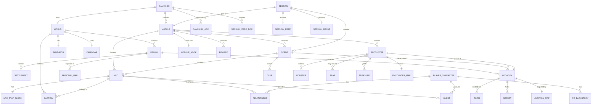
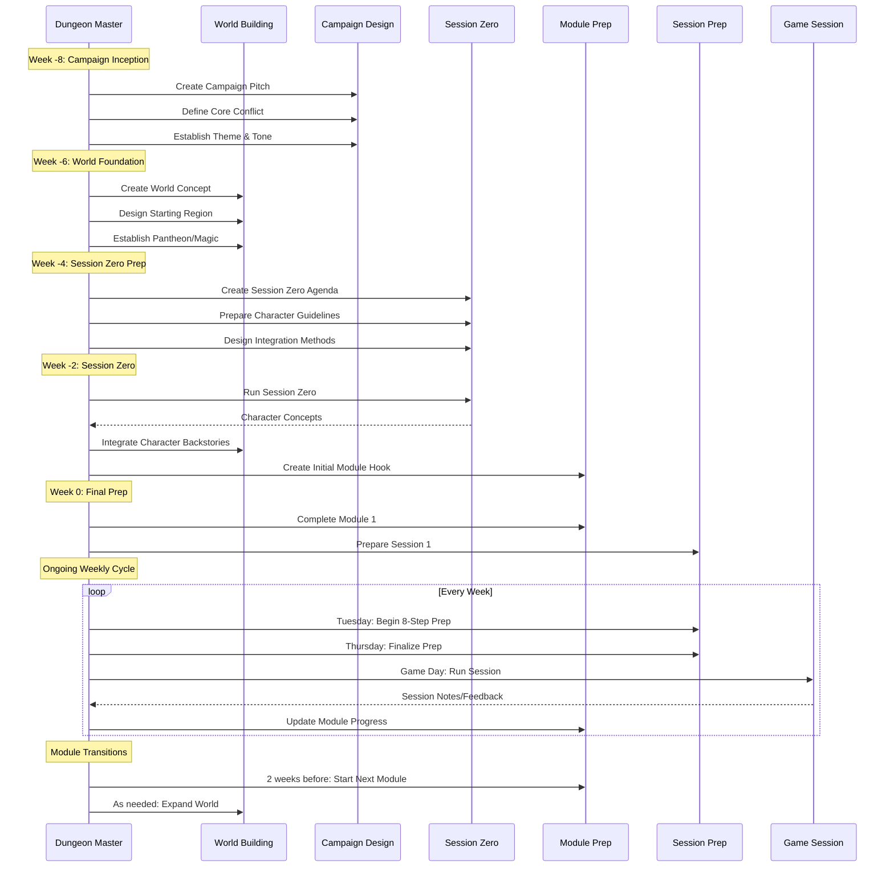

# D&D Campaign Management: ERD, Ontology, and Sequence Diagrams

## Entity Relationship Diagram (ERD)



## Hierarchical Ontology of Campaign Artifacts

### 1. Campaign Level (Created at Week -8 to -4)
```
CAMPAIGN/
├── Core Documents/
│   ├── Campaign Pitch (1 page)
│   ├── Campaign Bible
│   ├── Core Conflict Definition
│   ├── Six Truths Document
│   └── Theme & Tone Guide
├── Session Zero Materials/
│   ├── Session Zero Agenda
│   ├── Player Expectations Document
│   ├── Safety Tools & Boundaries
│   ├── Character Creation Guidelines
│   └── Group Contract
└── World Foundation/
    ├── World Concept (1-2 pages)
    ├── Calendar System
    ├── Pantheon Overview
    └── Magic System Rules
```

### 2. World Level (Created at Week -4 to 0, expanded as needed)
```
WORLD/
├── Geography/
│   ├── World Map (low detail)
│   ├── Starting Region Map
│   └── Climate & Geography Notes
├── Cultures & Factions/
│   ├── Major Faction List
│   ├── Cultural Overview (3-5 cultures)
│   └── Languages Document
├── History/
│   ├── Timeline (major events only)
│   ├── Creation Myth
│   └── Recent History (last 100 years)
└── Current State/
    ├── Political Landscape
    ├── Economic Overview
    └── Ongoing Conflicts
```

### 3. Regional Level (Created Week 0+, 1-2 weeks before needed)
```
REGION/
├── Regional Map (detailed)
├── Settlements/
│   ├── Major City (1-2)
│   ├── Towns (3-5)
│   └── Villages (as needed)
├── Points of Interest/
│   ├── Dungeons & Ruins
│   ├── Natural Landmarks
│   └── Mysterious Locations
├── Regional NPCs/
│   ├── Authority Figures
│   ├── Merchants & Services
│   └── Notable Personalities
└── Regional Conflicts & Hooks
```

### 4. Module Level (Created 2-4 weeks before play)
```
MODULE/
├── Module Overview/
│   ├── Module Hook Document
│   ├── Synopsis (1 page)
│   ├── Expected Duration
│   └── Level Range
├── Plot Structure/
│   ├── Beginning Scene
│   ├── Middle Challenges
│   ├── Climax Encounter
│   └── Resolution Options
├── Key NPCs/
│   ├── Antagonist(s)
│   ├── Allies
│   └── Neutral Parties
├── Locations/
│   ├── Primary Locations (2-3)
│   ├── Secondary Locations
│   └── Location Maps
└── Rewards/
    ├── Treasure
    ├── Information/Clues
    └── Story Advancement
```

### 5. Session Level (Created 3-7 days before session)
```
SESSION/
├── Session Prep (using 8-step process)/
│   ├── Character Review
│   ├── Strong Start
│   ├── Potential Scenes (3-5)
│   ├── Secrets & Clues (10)
│   ├── Fantastic Locations (2-4)
│   ├── Important NPCs
│   ├── Relevant Monsters
│   └── Selected Rewards
├── Reference Materials/
│   ├── Initiative Tracker
│   ├── NPC Quick Stats
│   └── Rules References
└── Post-Session/
    ├── Session Recap
    ├── XP/Milestone Tracking
    └── Notes for Next Session
```

### 6. Encounter Level (Created during session prep)
```
ENCOUNTER/
├── Combat Encounters/
│   ├── Battle Map
│   ├── Monster Stats
│   ├── Tactical Notes
│   ├── Environmental Hazards
│   └── Escape Routes
├── Social Encounters/
│   ├── NPC Goals & Motivations
│   ├── Information Available
│   ├── Potential Outcomes
│   └── Relationship Changes
└── Exploration Encounters/
    ├── Area Description
    ├── Skill Challenges
    ├── Discoveries/Secrets
    └── Resource Costs
```

## Sequence Diagram: Campaign Development Timeline



## Just-In-Time Artifact Creation Schedule

### Phase 1: Campaign Launch (Weeks -8 to 0)
| Week | Primary Tasks | Required Artifacts |
|------|--------------|-------------------|
| -8 | Campaign Concept | Campaign Pitch, Core Conflict |
| -7 | World Foundation | World Concept, Starting Region |
| -6 | Initial Development | Pantheon, Calendar, Magic System |
| -5 | Session Zero Prep | Agenda, Guidelines, Safety Tools |
| -4 | Session Zero | Character Sheets, Integration Notes |
| -3 | Character Integration | Updated World, Initial Hooks |
| -2 | Module 1 Development | Module Overview, First Locations |
| -1 | Final Preparation | Session 1 Prep, Starting NPCs |
| 0 | Campaign Launch | All Session 1 Materials |

### Phase 2: Active Campaign (Ongoing)
| Timing | Task | Required Artifacts |
|--------|------|-------------------|
| 2 weeks ahead | Module Planning | Module Overview, Major NPCs |
| 1 week ahead | Location Development | Maps, Location Descriptions |
| 3-7 days ahead | Session Prep (8 steps) | Scenes, NPCs, Encounters |
| Day of | Final Review | Initiative Tracker, Quick Refs |
| Day after | Post-Session | Recap, Notes, Updates |

### Phase 3: Expansion Triggers
| Trigger | Response | New Artifacts |
|---------|----------|---------------|
| Players leave region | Regional Development | New Regional Map, Settlements |
| New faction encountered | Faction Development | Faction Goals, NPCs, Resources |
| Major plot development | Arc Planning | Updated Campaign Arc, Fronts |
| Player backstory hook | Backstory Integration | Related NPCs, Locations |
| Random exploration | Location Generation | Dungeon/Town Details |

## Dependency Matrix

### Critical Path Dependencies
```
Campaign Pitch → World Concept → Starting Region → Session Zero
                                                 ↓
                                    Character Creation
                                                 ↓
                              Character Integration → Module 1
                                                           ↓
                                                    Session Prep
```

### Artifact Dependencies
| Artifact | Depends On | Enables |
|----------|------------|---------|
| Module | Campaign Arc, Regional Map | Session Prep |
| Session Prep | Module, Character Status | Game Session |
| NPC | Faction, Location | Social Encounters |
| Dungeon | Regional Map, Module Hook | Exploration |
| Battle Map | Location, Encounter | Combat |
| Treasure | Module Level, Encounter | Rewards |

## Storage and Organization System

### Digital Folder Structure
```
Campaign_Name/
├── 00_Campaign_Core/
│   ├── Campaign_Bible.md
│   ├── Session_Zero_Materials/
│   └── Player_Resources/
├── 01_World/
│   ├── Maps/
│   ├── Factions/
│   ├── Timeline/
│   └── Pantheon/
├── 02_Regions/
│   └── [Region_Name]/
│       ├── Regional_Map/
│       ├── Settlements/
│       └── NPCs/
├── 03_Modules/
│   └── Module_XX_Name/
│       ├── Overview.md
│       ├── Locations/
│       ├── NPCs/
│       └── Encounters/
├── 04_Sessions/
│   └── Session_XXX/
│       ├── Prep_Notes.md
│       ├── Recap.md
│       └── Handouts/
└── 05_Resources/
    ├── Rules_References/
    ├── Random_Tables/
    └── Templates/
```

## Key Principles

1. **Never Create More Than 2 Weeks Ahead** - Maintains flexibility for player actions
2. **Required Before Optional** - Create only what's needed for next session
3. **Reuse and Reference** - Link to existing artifacts rather than recreating
4. **Player-Driven Priorities** - Develop areas players show interest in
5. **Iterative Refinement** - Update artifacts based on actual play

This framework ensures you always know exactly what needs to be created and when, preventing both over-preparation and last-minute scrambling.