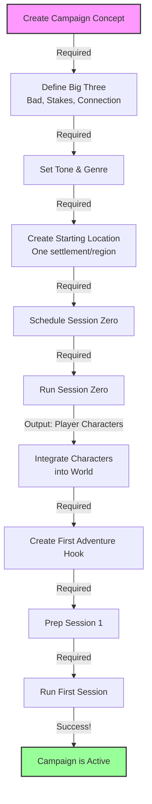
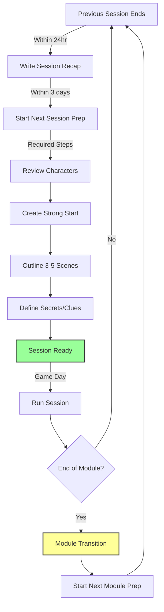
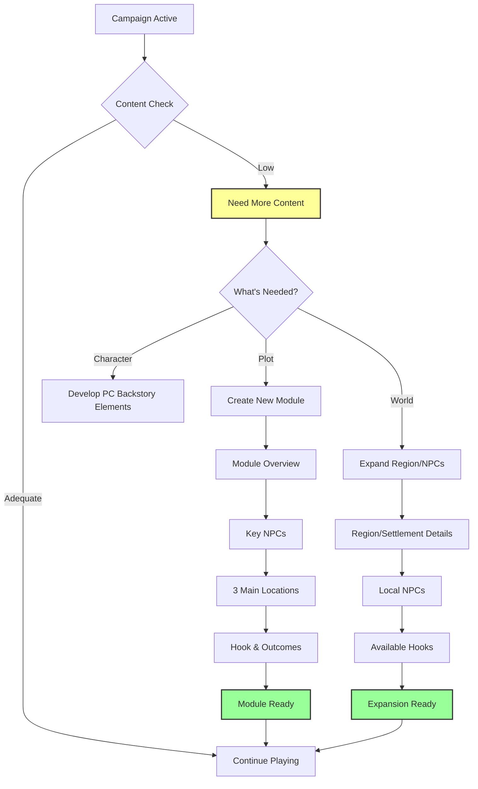
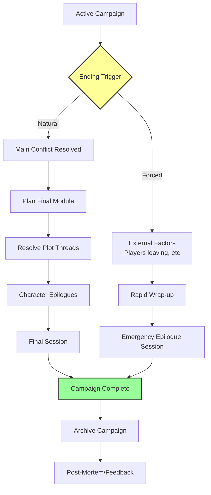
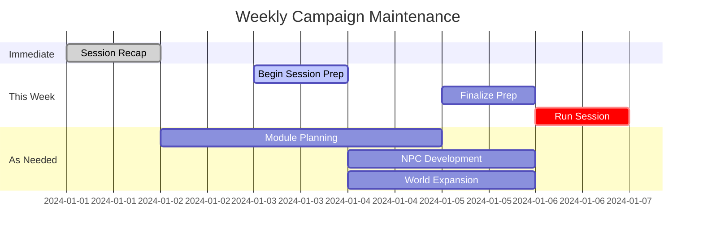

# D&D Campaign Core Workflows and Dependencies

## Workflow 1: Campaign Launch (One-Time)



**Minimum Viable Campaign Launch:**
- Campaign pitch (30 min)
- Starting location (30 min)
- Session Zero (2-3 hours)
- Character integration (1 hour)
- First session prep (1 hour)
- **Total: ~6 hours to launch**

## Workflow 2: Session Cycle (Repeating)



**Maintenance Requirements:**
- Recap previous session (15 min)
- Prep next session (30-60 min)
- Track what happened (during play)
- Transition modules (when needed)

## Workflow 3: Content Pipeline (As Needed)



## Workflow 4: Campaign Conclusion



## Critical Dependencies Chart

| Step | Must Have Before | Produces | Can't Skip Because |
|------|------------------|----------|-------------------|
| Session Zero | Campaign concept, basic world | Player characters | No PCs = No game |
| First Session | PCs, starting location, initial hook | Active campaign | Launches actual play |
| Session Prep | Previous recap, current status | Playable session | Improv has limits |
| Module Start | Completed previous, campaign status | New adventure arc | Need direction |
| Campaign End | Resolved/abandoned main conflict | Closure | Players need endings |

## Maintenance Activities Timeline



## Session Length Scaling

### How Session Length Affects Planning

| Session Length | Scenes | Prep Time | Module Length | Complexity |
|----------------|---------|-----------|---------------|------------|
| 1 hour (kids) | 1-2 | 15-20 min | 2-3 sessions | Simple |
| 2 hours | 2-3 | 30-40 min | 3-4 sessions | Moderate |
| 3 hours | 3-4 | 45-60 min | 3-5 sessions | Standard |
| 4+ hours | 4-6 | 60-90 min | 4-6 sessions | Full |

### Adjusted Workflows by Session Type

**Quick Sessions (1-2 hours):**
- Focus on single objective
- 1-2 simple encounters
- Linear scene progression
- Minimal prep between scenes

**Standard Sessions (3-4 hours):**
- Multiple objectives possible
- Mix of encounter types
- Room for exploration
- Player-driven tangents OK

**Marathon Sessions (5+ hours):**
- Complete story arcs
- Multiple locations
- Complex social encounters
- Significant progress expected

## "Done" Conditions

### Session is Done When:
- **Best**: Reached cliffhanger or natural stopping point
- **Good**: Energy flagging at scene boundary  
- **Acceptable**: Hit time limit mid-scene

### Design Sessions to Fit Time:
- **1 hour**: Design for 1 complete scene + cliffhanger
- **2 hours**: Design for 2-3 scenes with mini-arc
- **3 hours**: Design for complete adventure beat
- **4+ hours**: Design for multiple story beats

The goal is to structure content so natural endpoints align with time constraints.

### Module is Done When:
- Core conflict resolved
- Players ready to move on
- Usually 3-5 sessions

### Campaign is Done When:
- **Best Case**: Big Bad defeated, stakes resolved
- **Good Case**: Major arc completed, satisfaction achieved  
- **Acceptable**: Group decides to end, wrap-up provided
- **Emergency**: External factors, quick epilogue

## Minimum Viable System Must Support:

### Core Features (MVP)
1. **Campaign Creation**
   - Define concept and tone
   - Create starting location
   - Run session zero

2. **Session Management**
   - Prep upcoming session
   - Record what happened
   - Track who attended

3. **Content Pipeline**
   - Create/manage modules
   - Track NPCs (basic)
   - Note locations visited

4. **Progress Tracking**
   - Know what session we're on
   - See what's been played
   - Find things quickly

### Can Wait for v2:
- Detailed world building tools
- Complex relationship mapping
- Analytics and insights
- Player-facing features
- Advanced organization

## The Real Dependency: Time

```
Weekly Time Budget (Realistic):
- Post-session recap: 15 min
- Session prep: 45 min  
- Run session: 4 hours
- Module planning: 30 min every 2-3 weeks
- Total: ~5 hours/week when active

Crunch Periods:
- Campaign launch: 6 hours over 2-4 weeks
- Module transitions: +2 hours
- Campaign finale: +2-4 hours planning
```

The system succeeds if it:
1. Reduces prep time through templates/organization
2. Makes finding things instant vs hunting through folders
3. Tracks the boring stuff automatically
4. Never makes the DM do "homework" to use it