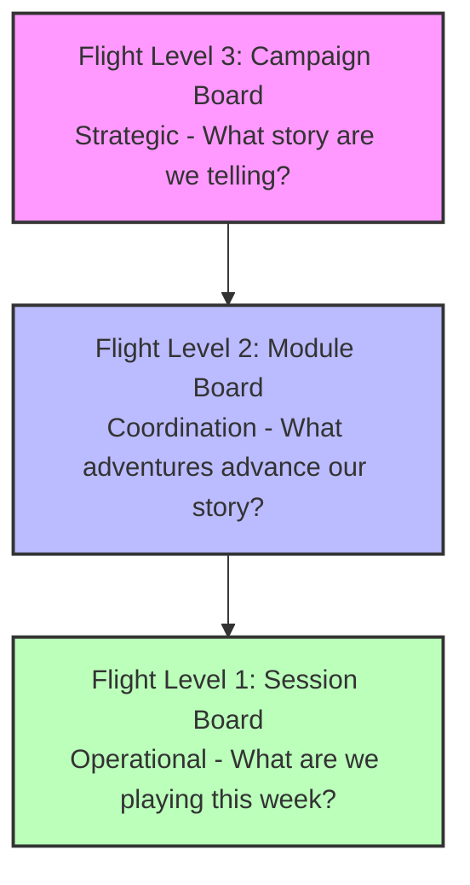
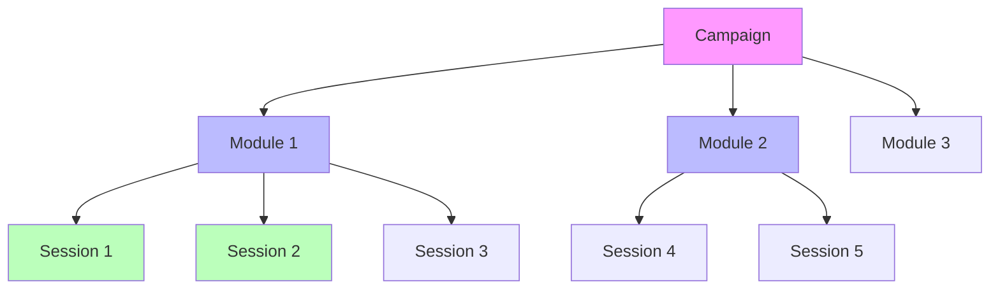

# D&D Campaign Management Flight Levels Workflow Model

## Overview: Three Flight Levels



## Flight Level 3: Campaign Board (Strategic)

### Phases and Exit Criteria

| Phase | Entry Criteria | Work Items | Exit Criteria | Next Phase |
|-------|---------------|------------|---------------|------------|
| **1. Concept** | DM has campaign idea | - Define Big Three<br/>- Set tone/genre<br/>- Choose session structure | - Pitch document complete<br/>- Session Zero date set | Inception |
| **2. Inception** | Pitch approved by group | - Create starting region<br/>- Build Session Zero materials<br/>- Define safety tools | - World foundation ready<br/>- Character creation rules set<br/>- Session Zero agenda complete | Session Zero |
| **3. Session Zero** | All players available | - Run Session Zero<br/>- Create characters<br/>- Establish group dynamics | - All PCs created<br/>- Party connections established<br/>- Schedule confirmed | Integration |
| **4. Integration** | Characters complete | - Tie PCs to world<br/>- Create first module<br/>- Prep Session 1 | - First adventure ready<br/>- All PCs have hooks<br/>- Session 1 scheduled | Active |
| **5. Active** | First session run | - Oversee modules<br/>- Track campaign arc<br/>- Maintain world consistency | - Main conflict approaching resolution<br/>- Or external factors require ending | Concluding |
| **6. Concluding** | End triggered | - Plan finale<br/>- Resolve threads<br/>- Design epilogue | - Final session complete<br/>- Epilogues delivered | Completed |
| **7. Completed** | Campaign ended | - Archive materials<br/>- Gather feedback<br/>- Document lessons | - All materials organized<br/>- Feedback collected | Archived |

### Campaign Board View
```
| Concept | Inception | Session Zero | Integration | Active | Concluding | Completed |
|---------|-----------|--------------|-------------|---------|------------|-----------|
| [Ideas] | [Current] | [Scheduled]  | [Prep]      | [Live]  | [Ending]   | [Done]    |
```

## Flight Level 2: Module Board (Coordination)

### Phases and Exit Criteria

| Phase | Entry Criteria | Work Items | Exit Criteria | Time Investment | Next Phase |
|-------|---------------|------------|---------------|-----------------|------------|
| **1. Backlog** | Campaign needs content | - Module concepts<br/>- Rough ideas<br/>- Player requests | - Selected for development | Ongoing collection | Planning |
| **2. Planning** | 2-4 weeks before needed | - Create module hook<br/>- Design key NPCs<br/>- Outline session breakdown | - Hook defined<br/>- 3-5 session arc clear<br/>- Major NPCs sketched | 30 minutes | Development |
| **3. Development** | Planning complete | - Detail locations<br/>- Create encounters<br/>- Write clues/secrets | - First 2 sessions preppable<br/>- Key locations mapped<br/>- NPCs statted | 3 hours | Ready |
| **4. Ready** | Fully preppable | - Review and polish<br/>- Create handouts<br/>- Final adjustments | - Could run tomorrow<br/>- All materials prepared | 30 minutes | Active |
| **5. Active** | Previous module done | - Run sessions<br/>- Track progress<br/>- Adjust as needed | - Core conflict resolved<br/>- Players ready to move on | 3-6 weeks | Completed |
| **6. Completed** | Module concluded | - Update campaign status<br/>- Note consequences<br/>- Archive materials | - Outcomes recorded<br/>- Next module selected | 15 minutes | Archived |

### Module Workflow Rules
- Maximum 3 modules in Planning/Development
- Only 1 module Active at a time
- Backlog prioritized by player interest and campaign needs
- Development starts when Active module is 50% complete

### Module Board View
```
| Backlog | Planning | Development | Ready | Active | Completed |
|---------|----------|-------------|--------|---------|-----------|
| [Ideas] | [2-4 wks]| [Detailing] | [Go]   | [Live]  | [Done]    |
```

## Flight Level 1: Session Board (Operational)

### Phases and Exit Criteria

| Phase | Entry Criteria | Work Items | Exit Criteria | Next Phase |
|-------|---------------|------------|---------------|------------|
| **1. Upcoming** | Module is active | - Session placeholder<br/>- Date confirmed | - 1 week until session | Prep Needed |
| **2. Prep Needed** | 1 week out | - Review previous session<br/>- Check module status | - Prep time available | In Prep |
| **3. In Prep** | DM has time | - Run 8-step process<br/>- Design to session length<br/>- Create materials | - All 8 steps complete<br/>- Materials ready<br/>- Ending designed | Ready |
| **4. Ready** | Prep complete | - Final review<br/>- Gather materials<br/>- Set up space | - Game day arrives | Running |
| **5. Running** | Session time | - Execute session<br/>- Track events<br/>- Note changes | - Reached designed ending<br/>- Or time/energy limit | Needs Recap |
| **6. Needs Recap** | Session complete | - Write summary<br/>- Update trackers<br/>- Note consequences | - Recap written<br/>- Status updated | Completed |
| **7. Completed** | Recap done | - Archive materials<br/>- Update module progress | - All documentation complete | Archived |

### Session Workflow Rules
- Maximum prep time: Session length ÷ 4
- Recap due within 48 hours
- Prep starts minimum 3 days before session
- "Ready" sessions can be run anytime

### Session Board View
```
| Upcoming | Prep Needed | In Prep | Ready | Running | Needs Recap | Completed |
|----------|-------------|---------|--------|---------|-------------|-----------|
| [+2 wks] | [This week] | [WIP]   | [Go]   | [NOW]   | [48hr]      | [Done]    |
```

## Work Item Relationships



## Flow Policies

### Cascade Rules
1. **Campaign → Module**: When campaign enters "Active", first module must be "Ready"
2. **Module → Session**: When module enters "Active", first session enters "Prep Needed"
3. **Session → Module**: When last session completes, module moves to "Completed"
4. **Module → Campaign**: Campaign health checked after each module completes

### WIP Limits
- **Campaign Level**: 1 active campaign per DM
- **Module Level**: 1 active, 1 ready, 2 in development
- **Session Level**: 1 running, 1 ready, 2 in prep

### Pull Triggers
- **New Module Needed**: When active module is 60% complete
- **New Session Prep**: When 7 days until session date
- **Recap Required**: Immediately after session ends

## Metrics at Each Level

### FL3: Campaign Metrics
- Modules completed vs planned
- Character spotlight balance
- Main plot advancement
- Player satisfaction trend

### FL2: Module Metrics
- Sessions per module (actual vs planned)
- Prep time per module
- Player engagement rating
- Plot threads advanced

### FL1: Session Metrics
- Ending satisfaction (1-5)
- Actual vs planned duration
- Scenes completed vs planned
- Prep time taken

## Implementation in Database

```sql
-- Workflow states for each level
CREATE TABLE workflow_states (
    id INTEGER PRIMARY KEY,
    level VARCHAR(20), -- 'campaign', 'module', 'session'
    state_name VARCHAR(50),
    state_order INTEGER,
    description TEXT,
    entry_criteria TEXT,
    exit_criteria TEXT
);

-- Track state transitions
CREATE TABLE state_transitions (
    id INTEGER PRIMARY KEY,
    entity_type VARCHAR(20), -- 'campaign', 'module', 'session'
    entity_id INTEGER,
    from_state VARCHAR(50),
    to_state VARCHAR(50),
    transitioned_at TIMESTAMP DEFAULT CURRENT_TIMESTAMP,
    notes TEXT
);

-- Work items at each level
ALTER TABLE campaigns ADD COLUMN workflow_state VARCHAR(50) DEFAULT 'concept';
ALTER TABLE modules ADD COLUMN workflow_state VARCHAR(50) DEFAULT 'backlog';
ALTER TABLE sessions ADD COLUMN workflow_state VARCHAR(50) DEFAULT 'upcoming';

-- WIP tracking
CREATE VIEW current_wip AS
SELECT 
    'campaign' as level,
    COUNT(*) as count,
    workflow_state
FROM campaigns
WHERE workflow_state NOT IN ('completed', 'archived')
GROUP BY workflow_state
UNION ALL
SELECT 
    'module' as level,
    COUNT(*) as count,
    workflow_state
FROM modules
WHERE workflow_state NOT IN ('completed', 'archived')
GROUP BY workflow_state
UNION ALL
SELECT 
    'session' as level,
    COUNT(*) as count,
    workflow_state
FROM sessions
WHERE workflow_state NOT IN ('completed', 'archived')
GROUP BY workflow_state;
```

## Benefits of Flight Levels Approach

1. **Clear Visualization**: See bottlenecks at each level
2. **Predictable Flow**: Know what needs attention when
3. **Reduced Overwhelm**: Focus on one level at a time
4. **Better Planning**: See work coming down the pipeline
5. **Natural Rhythm**: Matches the actual flow of D&D campaigns

The system naturally prevents common problems:
- Can't start sessions without characters (FL3 gates FL1)
- Won't run out of content (FL2 pipeline visible)
- Prep doesn't pile up (WIP limits on FL1)
- Campaign doesn't stagnate (FL3 health checks)